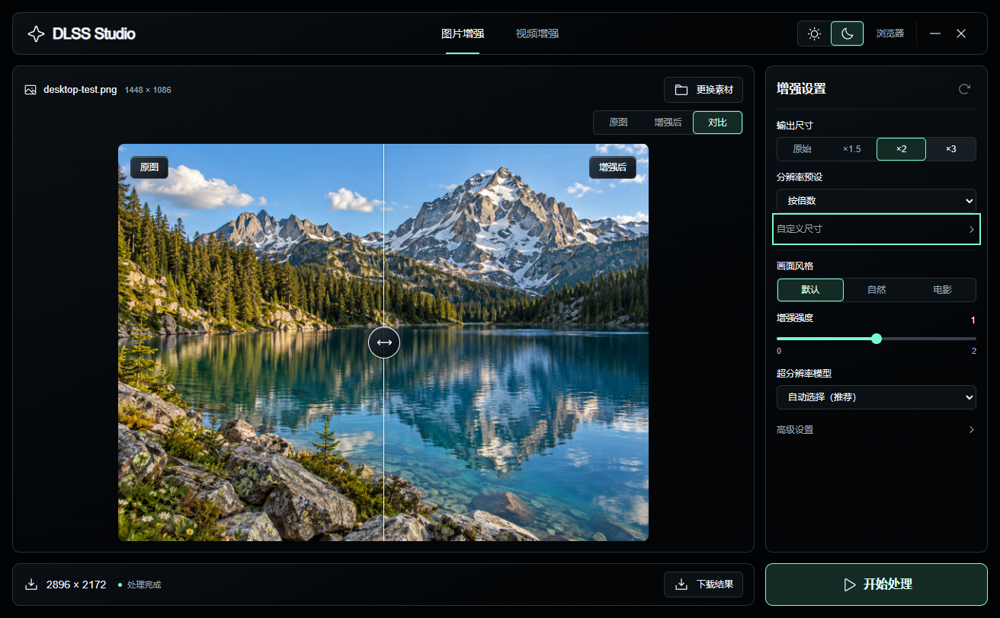

# DLSS-Studio-Windows

面向 Windows 的 DLSS 图片与视频增强工作台，提供中文界面、深浅主题与无边框独立桌面窗口。

> 本项目原创部分采用 MIT 许可；上游代码及第三方组件不在本项目重新授权范围内，详见 [许可说明](THIRD-PARTY-NOTICES.md)。

## 功能

- 图片与视频增强，支持输出尺寸、画面风格及高级参数设置。
- 图片原图、结果与拖动对比；视频预览与文件下载。
- 深浅主题、透明预览背景和扁平控件；主界面适配窗口，高级参数使用独立面板，小窗口自动分页。
- `DLSS Studio.exe`：内嵌 WebView2，直接显示完整工作台，无系统边框；支持拖动、调整大小、右上角最小化和关闭。
- 独立窗口右上角“浏览器”可打开同一 Web 服务，无需第二个启动器。关闭独立窗口会停止服务；外部浏览器与独立窗口的当前素材和预览独立保存。
- 默认端口被占用时自动选择可用端口，仅监听 `127.0.0.1`。
- 检查显卡编码可用性，不可用时默认采用 ProRes CPU 编码。

## 下载与使用

发行包使用 [GitHub Releases](https://github.com/LeoSasion/DLSS-Studio-Windows/releases) 分发。当前提交为源码版，首个发行版尚未公开发布；Gitee 镜像尚未配置。

获取发行包后，完整解压 ZIP，双击 `DLSS Studio.exe` 直接进入独立窗口。需要外部浏览器时，点击窗口右上角“浏览器”，并保持独立窗口开启或最小化。Python 运行环境随发行包提供。独立窗口还使用 Microsoft WebView2；缺少时可选择通过包内微软引导程序联网安装。

Windows x64；DLSS 神经渲染需要兼容的 NVIDIA 显卡与驱动。CPU 编码仅负责视频编码，不能替代神经渲染所需的显卡。

## 源码运行

1. 安装 Python 3.10 x64，在项目根目录创建环境：`python -m venv app/.venv`。
2. 安装锁定依赖：`app\.venv\Scripts\python.exe -m pip install -r app/requirements-installed.txt`。
3. 从上游项目自行取得所需处理引擎及 FFmpeg，保持上游发布目录结构，将它们放到 `app/out/`。源码仓库不含这些二进制文件。
4. 双击 `start-web.bat`。

原始依赖项目：[DaniilSokolyuk/video2dlssnr](https://github.com/DaniilSokolyuk/video2dlssnr)。请参阅上游的运行要求及适用条款。

## 目录

| 目录或文件 | 用途 |
| --- | --- |
| `app/web/` | 中文前端与主题 |
| `app/studio_server.py` | 上传、任务队列、处理引擎桥接与下载服务 |
| `app/app.py`、`app/nr_video.py` | 上游代码及本地适配，许可待确认 |
| `packaging/DesktopShell.cs` | 无边框 WebView2 桌面窗口 |
| `packaging/StudioService.cs` | 服务进程管理 |
| `packaging/` | 便携包构建脚本与使用说明 |

上传素材保存在 `app/uploads/`，结果保存在 `app/ui_out/`。以上目录、Python 运行环境和发行 ZIP 均排除在源码仓库之外。

## 验证情况

Windows 工作站已验证独立解压、包内 Python 依赖加载、EXE 服务启停、端口占用自动切换，以及图片 2 倍增强和短视频 ProRes 导出。独立窗口另行验证深浅主题、上传、处理、对比、下载、最小化及关闭清理。未声称所有显卡、驱动或长视频均已测试。

## 来源和许可

这不是 NVIDIA 官方项目。DLSS 等名称归相应权利人所有。

上游代码、NVIDIA DLL、FFmpeg、Python、Python 依赖和 Phosphor 图标分别受其适用条款约束。未对第三方组件统一套用 MIT 或其他新许可证。

本项目原创的前端、服务桥接和 EXE 启动器采用 **MIT License**，见 [LICENSE](LICENSE)。授权范围及第三方归属见 [许可说明](THIRD-PARTY-NOTICES.md)。

## 构建与验证

准备好依赖环境与 `app/out/` 后，执行 `app\.venv\Scripts\python.exe packaging/build_package.py`，再执行 `app\.venv\Scripts\python.exe packaging/archive_package.py`。构建会从微软 NuGet 获取固定版本的 WebView2 SDK，并验证微软引导安装器签名。

`packaging/verify_package.py` 会独立解压发行包，验证所有校验值，并测试唯一 EXE 的服务管理及无边框桌面窗口，包括真实图片处理、下载、最小化与关闭。该验证需要兼容显卡。
